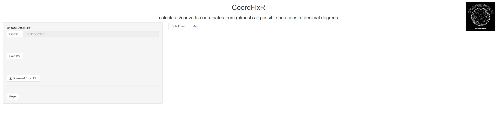
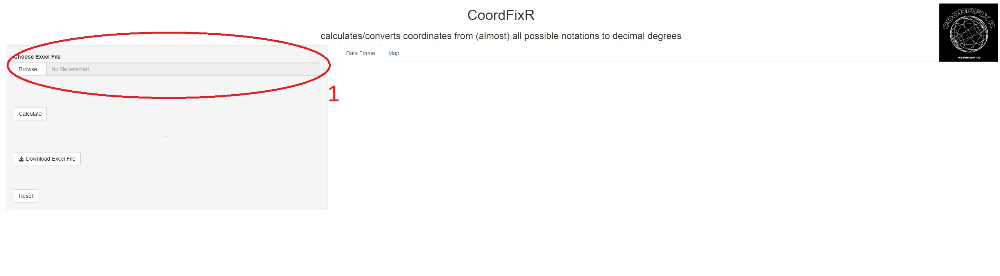
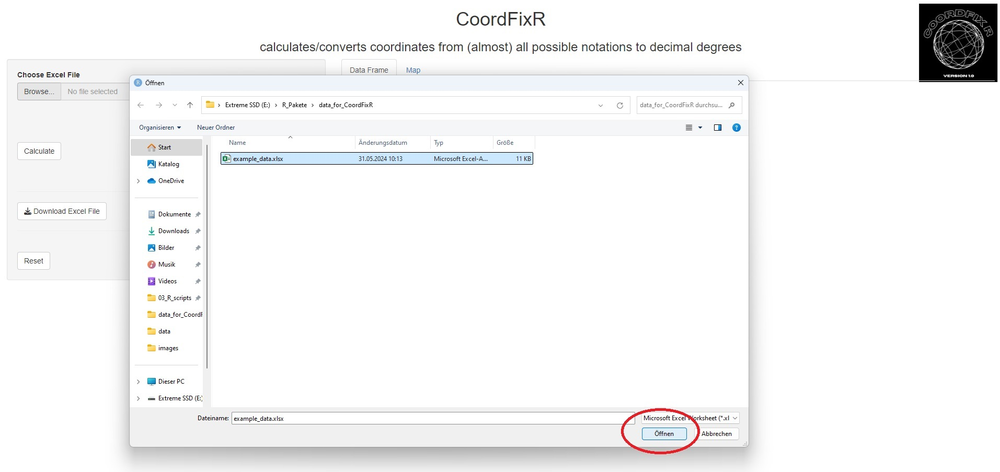
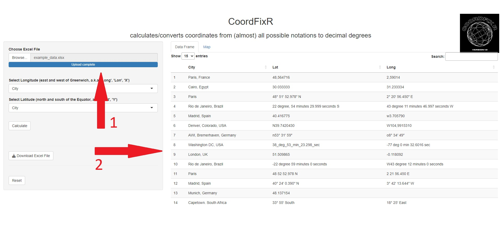
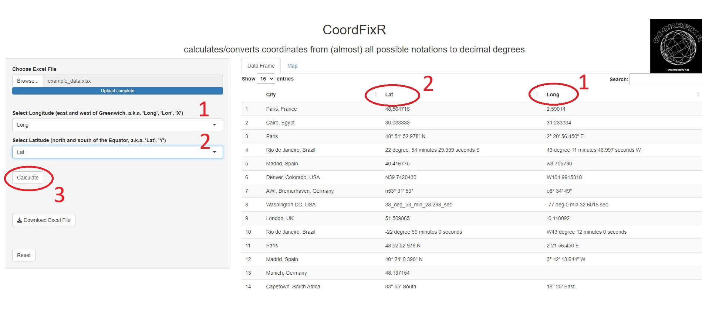
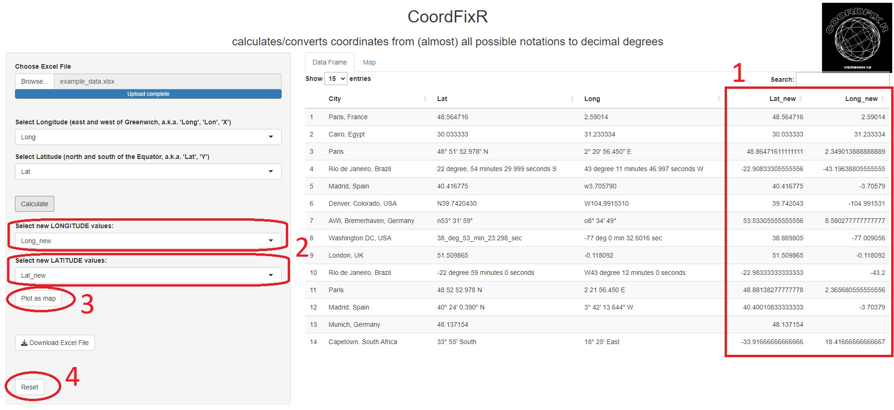
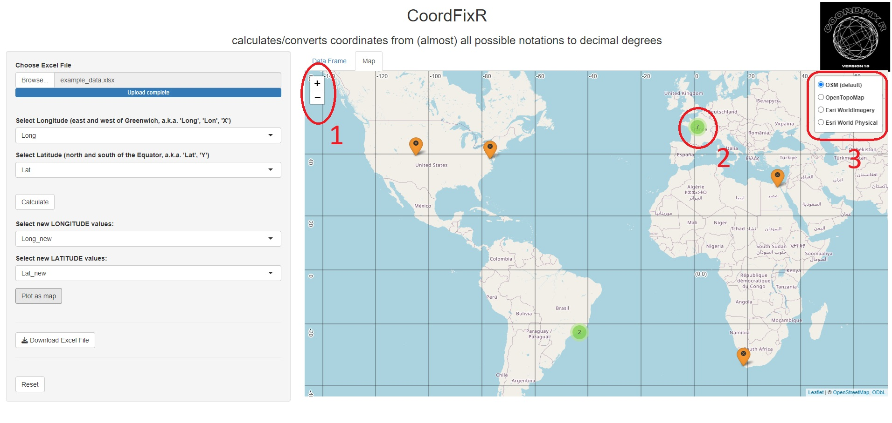
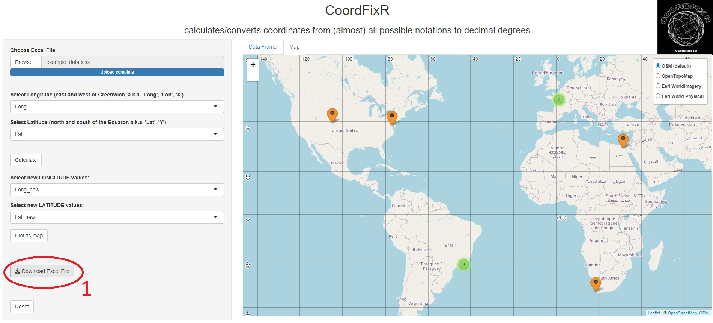
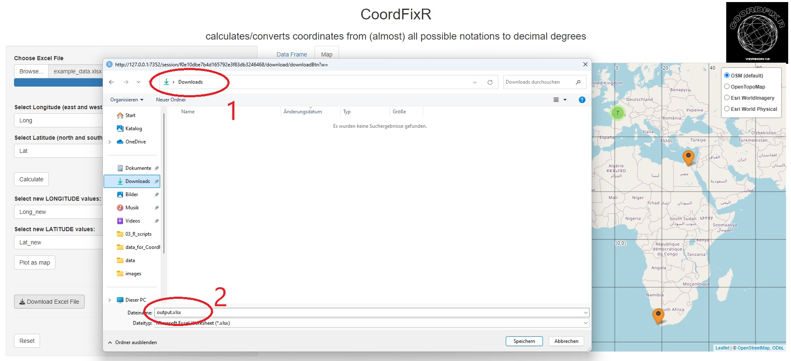

CoordFixR Readme
================
Hendrik Pehlke
2024-09-25

<!-- README.md is generated from README.Rmd. Please edit this file, if necessary -->

|                                                                                                                                                                                                                                                            |
|------------------------------------------------------------------------------------------------------------------------------------------------------------------------------------------------------------------------------------------------------------|
| The development of the ‘CoordFixR’ R-package is a result of the [**CoastCarb**](https://coastcarb.eu/) programme, funded under the European Union’s Horizon 2020 research and innovation programme under Marie Skłodowska-Curie Grant Agreement No 872690. |

## **Table of Contents**

- [Description](#Description)
- [Requirements for the data to be loaded](#Requirements)
- [Functions](#Functions)
- [Installation](#Installation)
- [Load package into R](#Load)
- [Help or info](#Help)
- [Start the app](#app)
- [Work with the app](#Usage)
- [Examples](#Examples)
- [Author](#Authors)
- [Changelog](#Changelog)
- [Contact](#Contact) <br> <br>

# **Description**

The **CoordFixR** package provides an **R Shiny App that processes
coordinates from a variety of notations and converts them to decimal
degrees** (see **Examples**).

## Supports a wide variety of formats and notations

CoordFixR supports a wide range of formats, including those with

- symbols for degree, minutes and seconds (°, ‘,’’),
- specification in word form such as ‘**degree**’, ‘**minutes**’,
  **seconds**’ or
- their abbreviations (‘**deg**’, ‘**min**’, ‘**sec**’).

## Can handle typos or slight changes

Even spelling mistakes (e.g. ‘deegrees’) or slight changes
(e.g. ‘degree’ or ‘Degrees’ instead of ‘degrees’) are processed by the
app without any problems.

## Can handle different hemisphere designations

The app can also process different types of hemisphere designations such
as

- ‘North or N’,
- ‘South or S’,
- ‘East or E’ or,
- ‘West or W’.

The app also correctly interprets simple **minus signs (‘-’)** for the
southern and western hemispheres.

## Supporting different separators

CoordFixR can process various separators such as

- spaces (e.g. -9° 5’ 23.5’’),
- slashes (e.g. -9°/5’/23.5’’),
- back slashes (e.g. -9°\5’\23.5’’),
- underscores (e.g. -9°\_5’\_23.5’’) or
- combinations of these (e.g. 9°\_5’\_23.5’’/S)

## Can also handle leading zeros

CoordFixR can also process coordinates which contain leading zeros
(e.g. -009° 05’23’’).

## Accepts different decimal separators

CoordFixR accepts both **points (‘.’)** and **commas (‘,’)** as decimal
separators (‘-9 deg 5 min 23.5 sec’ or ‘-9 deg 5 min 23,5 sec’). The
comma as a decimal separator is widely used in continental Europe
(e.g. Germany, France, Italy, Poland, etc.) and South America
(e.g. Argentina, Chile, Brazil, etc.).

The new (converted) decimal degrees will have a decimal point
(e.g. -9.089861). <br> <br>

# **Requirements for the data to be loaded**

At present, the data to be loaded must be in Excel format (xls or xlsx).

The data must also contain one column with latitudes and one column with
longitudes.

The column name of these columns is not important as long as the user
knows which column contains the longitude information and which column
contains the latitude information.

No further requirements need to be met.

Examples of how the individual data in the columns can look are shown
below. (see examples).

<br> <br>

# **Functions**

**Load Excel data:**

Users can select and upload an Excel file from their hard drive or other
storage device.

**Column selections:**

Users can select the columns of the loaded table that contain the
geographical coordinates.

**Coordinate conversion**

The app converts various coordinate formats (e.g. DMS, DDM) into decimal
degress (DD) and creates new columns with the converted values.

**Visualisation:**

After conversion, users can plot the converted coordinates (points) on a
interactive leaflet map to visualize their position. In this way, errors
(e.g. confusion of x and y) or incorrect or missing hemisphere
information can be quickly recognized and corrected.

**Interactivity:**

Because CoordFixR is an R-shiny application, the user can change his
entries over and over again and these changes are immediately displayed
interactively.

**Results storage:**

The modified table, which now contains two new columns with the decimal
coordinates, can be saved in the user’s system as an Excel file.

The package is designed to simplify coordinate transfer for users who
frequewntly deal with mixed-format geographic data. <br> <br>

## **Installation**

To install the app from GitHub you have to install the package
‘devtools’ first.

``` r
install("devtools") # if the package 'devtools' is not already installed on your device

# install the development version from GitHub
devtools::install_github("HP-AWI/CoordFixR")
```

<br> <br>

## **Load package into R**

It is useful to load the package into R. To do so just use the
followoing command:

``` r
# load the package 'CoordFixR'
library(CoordFixR)
```

<br> <br>

## **Help or info**

If you looking for help or more info use this commands:

``` r

# for help or further info type
?CoordFixR

# or
?launch_app
```

<br> <br>

## **Start the app**

You run the app just type the following command:

``` r
# start the app
CoordFixR::launch_app()
```

<br> <br>

## **Work with the app**

If the user executes the ‘CoordfixR::launch_app()’ command in R, an
R-Shiny app opens and the following window (see next figure) appears.
<br> <br>

<br> <br> Left click on ‘Browse’ (1) under ‘Select Excel File’ to open
an explorer window where you can select an Excel file on your computer
hard drive or other storage device (e.g. USB stick). <br> <br>

<br> <br> The following figure shows how to browse for and select an
Excel file. In this example an external portable hard drive was chosen.
Left-click ‘Open’ to load the selected Excel file into R. <br> <br>

<br> <br> As soon as the Excel file is fully loaded (see next figure,
\[1\]), the file is displayed as a table in the main window (next
figure, \[2\]). <br> <br>

<br> <br> In the next step, the user needs to select the respective
columns that contain the information about the longitude (aka ‘Long’,
‘Lon’ or also ‘’X’) and latitude (aka ‘Lat’ or ‘Y’) (see next figure,
steps 1 and 2).

Once the correct columns have been selected, the conversion of the
coordinates is started by left-clicking on ‘Calculate’ \[3\]. <br> <br>

<br> <br> When the calculation is complete, two new columns are added to
the table containing the converted coordinates in decimal degree format.
The decimal separator is a period.

The name of the two new columns is derived from the name of the original
column, to which a ’\_new’ is added. (see next figure, \[1\]). At the
same time, these new column names are automatically inserted in the
correct order in the map creation selection windows (see next figure,
\[2\]).

Left-clicking on ‘Plot as Map’ will display the decimal coordinates as
points on an interactive map \[3\]. If you accidentally select the wrong
column, left-click on ‘Reset’ \[4\] to clear all selections and
calculations and start again. <br> <br>

<br> <br> The map (see next figure) shows the geographical position of
the points after the coordinates have been converted. The map is
interactive; you can zoom in and out by scrolling the mouse wheel or
clicking on the plus and minus signs on the map \[1\]. If several points
are close together, this is indicated by a) the green colour and b) a
number inside the green point. The number represents the number of
neighbouring points \[2\]. Left-clicking on a point automatically zooms
it in. Other ‘basemaps’ can also be selected \[3\]. <br> <br>

<br> <br> If you are happy with the result, you can save the modified
table as a new Excel spreadsheet by left-clicking on ‘Download Excel
File’ (next figure, \[1\]). <br> <br>

<br> <br> The default path is the ‘Downloads’ folder (see next figure,
\[1\]) and the default name of the Excel file is ‘output.xlsx’ \[2\].
Both can be changed by the user in the window that opens. <br> <br>

<br> <br>

## **Examples**

‘48° 51’ 52.978” North’ will be converted to ‘48.86471611111111’

‘-22 degree 59 minutes 0 seconds’ will be converted to
‘-22.98333333333333’

‘W_38_deg_53_min_23.298_sec’ will be converted to ‘-38.889805’

‘S77 deg 0 min 32.6016 sec’ will be converted to ‘-77.009056’

More than 460 different spellings of coordinates were tested and could
be converted into decimal degrees. <br> <br>

## **Author**

**CoordFixR** was created by **[Hendrik
Pehlke](https://github.com/uHP-AWI)**. <br> <br>

## **Changelog**

- **0.1.0:** Initial release<br> <br>

## **Contact**

If you have any questions or comments about the package **CoordFixR**,
please contact **[Hendrik Pehlke](hendrik.pehlke@awi.de)**.
